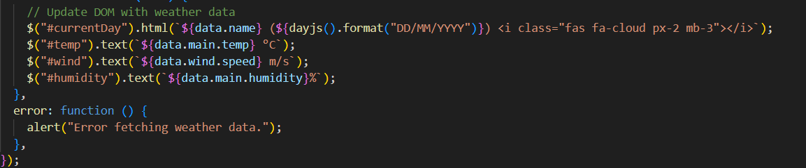
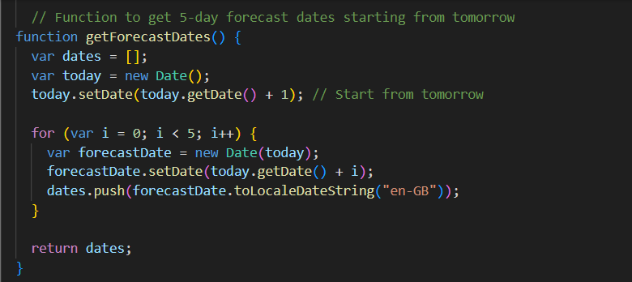

# Weather-App Dashboard
## Description

The Weather Dashboard is a web application that allows travelers to see the weather outlook for multiple cities. The application provides current and future weather conditions for a searched city, adds the city to the search history, and displays a 5-day forecast. The weather data is retrieved from the OpenWeather API, and localStorage is utilized to store persistent data.

## Code Snapshot

## Dependencies
- jQuery
- dayjs
- OpenWeatherMAp
## Author
Nonso Iwedinobi

## License
This project is licensed under the [MIT License](LICENSE).